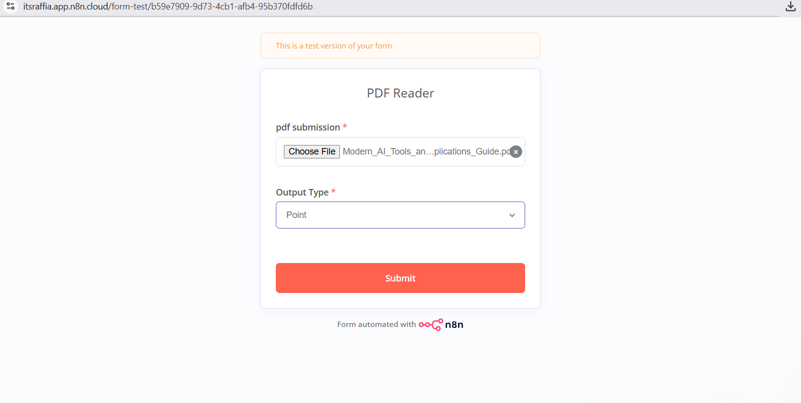
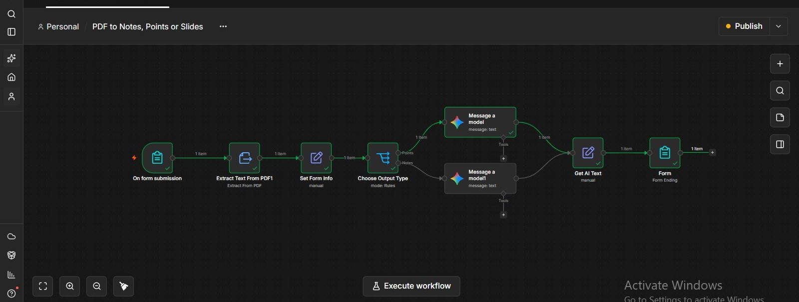
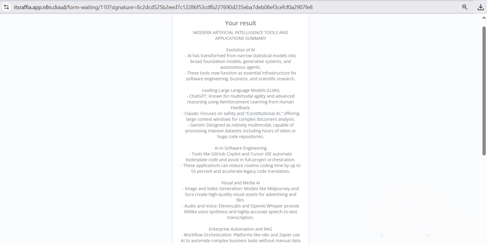
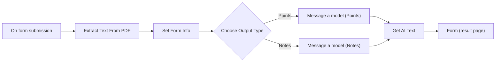

# PDF to Notes and Points: n8n Automation Workflow

An n8n workflow that converts an uploaded PDF document into either concise bullet points or structured study notes using Google Gemini. Users interact through a simple web form, and the result is displayed on the final page of the same form.

## Table of Contents

- [Overview](#overview)
- [Screenshots](#screenshots)
- [Key Features](#key-features)
- [Technology Stack](#technology-stack)
- [Pipeline Architecture](#pipeline-architecture)
- [Pipeline Stages in Detail](#pipeline-stages-in-detail)
- [Node Reference](#node-reference)
- [Prerequisites](#prerequisites)
- [Installation and Setup](#installation-and-setup)
- [Usage](#usage)
- [Limitations](#limitations)
- [Possible Improvements](#possible-improvements)

## Overview

Reading long PDF documents to extract the main ideas is time consuming. This workflow automates that task. A user uploads a PDF, chooses the type of output they want, and receives an AI-generated summary in seconds. No coding or manual copying of text is required.

## Screenshots

### 1. Test Session

### 2. Workflow

### 3. Result

## Key Features

- Web form interface for uploading a PDF and selecting the output type
- Automatic text extraction from PDF files
- Two output modes:
  - **Points**: a short, clear bullet-point list with one idea per bullet
  - **Notes**: well-organized study notes written in short paragraphs
- Conditional routing, so each request is handled by a prompt designed for the chosen format
- Result displayed directly on the completion page of the form
- Fully visual, low-code implementation that is easy to modify

## Technology Stack

| Component | Purpose |
| --- | --- |
| n8n | Workflow automation platform (cloud or self-hosted) |
| n8n Form Trigger and Form nodes | User interface for input and output |
| Extract From File node | PDF text extraction |
| Google Gemini (Message a model node) | Text generation |

## Pipeline Architecture

The workflow is a linear pipeline with a single branching point. Every request passes through input, extraction, preparation, and routing. It then follows one of two AI processing branches before the branches merge again for response formatting and delivery.

## Pipeline Stages in Detail

### Stage 1: Input

**Node:** On form submission

The workflow starts when a user submits a web form. The form contains two required fields:

- **PDF submission**: a file upload field that accepts a single `.pdf` file
- **Output Type**: a dropdown with the options Points and Notes

The Form Trigger is configured to respond through the Form node at the end of the workflow. This keeps the browser session open while processing runs and lets the result appear on the final page.

### Stage 2: Text Extraction

**Node:** Extract Text From PDF

This node reads the uploaded PDF from the binary data of the submission and converts it into plain text. The binary property name is detected dynamically, so the node works regardless of how the form names the uploaded file. The extracted text is stored in the `text` field of the output item.

### Stage 3: Data Preparation

**Node:** Set Form Info

This node creates a clean and consistent data structure for the rest of the pipeline. It produces two fields:

- `text`: the extracted PDF content
- `outputType`: the value selected in the form, converted to lowercase so that routing does not depend on capitalization

Keeping preparation in a separate step means later nodes only need to read simple, predictable fields.

### Stage 4: Routing

**Node:** Choose Output Type

A Switch node evaluates the `outputType` field and sends the item to the matching branch:

| Rule | Condition | Destination |
| --- | --- | --- |
| Points | `outputType` contains "point" | Points branch |
| Notes | `outputType` contains "note" | Notes branch |

The comparison is case-insensitive and uses a "contains" operator, which makes the routing tolerant of small variations in the value.

### Stage 5: AI Processing

**Nodes:** Message a model (Points) and Message a model (Notes)

Each branch sends the extracted PDF text to Google Gemini with a prompt written for that output format:

- **Points branch:** instructs the model to produce a short bullet-point list in simple language, with one idea per bullet.
- **Notes branch:** instructs the model to produce clear, well-organized study notes using short paragraphs and simple language.

Separating the branches keeps each prompt focused and makes it easy to adjust the style of one output without affecting the other.

### Stage 6: Response Formatting

**Node:** Get AI Text

Both AI branches merge into this node. It extracts the generated text from the model response and stores it in a single field. Because both branches end here, the final step is written only once regardless of which output type was chosen.

### Stage 7: Output

**Node:** Form (Form Ending)

The last node completes the form and displays the generated result to the user on a completion page. Line breaks in the generated text are preserved for readability.

## Node Reference

| Order | Node name | Node type | Role |
| --- | --- | --- | --- |
| 1 | On form submission | Form Trigger | Collects the PDF and output type |
| 2 | Extract Text From PDF | Extract From File | Converts the PDF into plain text |
| 3 | Set Form Info | Edit Fields (Set) | Prepares `text` and `outputType` |
| 4 | Choose Output Type | Switch | Routes to the correct AI branch |
| 5a | Message a model | Google Gemini | Generates bullet points |
| 5b | Message a model1 | Google Gemini | Generates study notes |
| 6 | Get AI Text | Edit Fields (Set) | Extracts the generated text |
| 7 | Form | Form (Completion) | Displays the result |

## Prerequisites

- An n8n instance (n8n Cloud or self-hosted)
- A Google Gemini API key, which can be created in Google AI Studio

## Installation and Setup

1. Download the workflow JSON file from this repository.
2. In n8n, create a new workflow and choose **Import from File**, or paste the JSON directly onto the canvas.
3. Open each **Message a model** node and select or create a Google Gemini credential using your own API key. API keys are never included in the exported workflow file.
4. Run the workflow once using the test URL of the **On form submission** node to confirm that everything works.
5. Publish (activate) the workflow to make the production form URL available.

## Usage

1. Open the form URL of the **On form submission** node.
2. Upload a PDF file.
3. Select the output type: **Points** or **Notes**.
4. Submit the form.
5. Wait for processing to finish. The result appears on the completion page.

## Limitations

- Only text-based PDFs are supported. Scanned documents or images inside PDFs require OCR, which this workflow does not include.
- One PDF can be processed per submission.
- Very large documents may exceed the input limit of the selected model.
- AI-generated summaries can contain mistakes or omit details. Important content should be checked against the original document.

## Possible Improvements

- Add a third output mode that generates a slide-by-slide outline
- Support multiple PDF uploads in a single submission
- Add OCR for scanned documents
- Split very long documents into chunks and combine the partial summaries
- Export the result as a downloadable Word or PDF file
- Accept input through other channels, such as email or a chat platform
